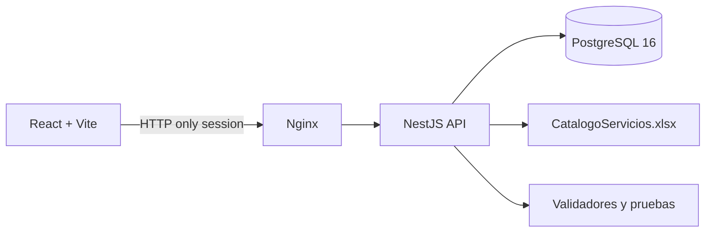
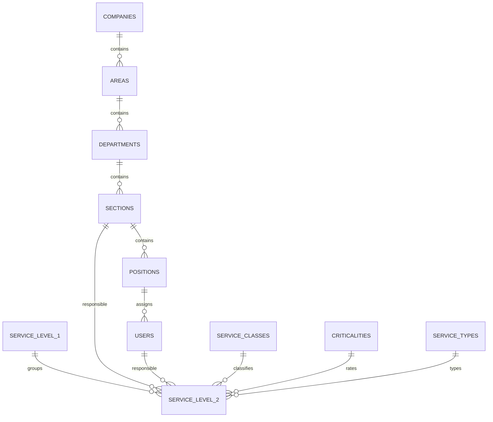

# Resolución del parcial

## 1. Problema y alcance

La aplicación convierte el catálogo de servicios del Excel en un sistema web con autenticación local, organización, mantenimientos, responsables, importación repetible y trazabilidad.

No se implementan tickets, facturación ni consumo de servicios porque el enunciado los excluye.

## 2. Arquitectura y tecnologías



El backend usa `pg` con SQL parametrizado. Las migraciones están en `database/migrations/`. No se utiliza Prisma.

## 3. Modelo de datos



Los códigos subordinados son únicos dentro de su padre. Los servicios tienen códigos únicos globales. `minimum` y `maximum` son opcionales y se validan sin convertir ausencias en cero.

## 4. Importación y calidad

El importador lee `Servicios Externos`, resuelve el valor del ancla de cada celda combinada y solo crea un servicio de nivel 2 cuando existe un código. Las filas de continuación se omiten y se registran como observación agregada.

Para `SE.12`, se conserva como nombre canónico el primer valor, `Suministrar Analitica`, y se registra el nombre alternativo de la fila 100. Las filas 99–101 mantienen sus atributos ausentes como `NULL` y quedan en estado `REVIEW`.

Cada servicio conserva hoja, fila y transformaciones. La importación usa `upsert` por código dentro de una transacción y registra `import_runs` e `import_observations`.

## 5. Seguridad

Las contraseñas se almacenan con `bcryptjs` y sal. Las sesiones son HTTP-only y se guardan en PostgreSQL. `AuthGuard` valida la cuenta en el servidor en cada solicitud y `RolesGuard` impide operaciones de administrador para el rol de consulta.

## 6. Context engineering

El contexto operativo está en `AGENTS.md`. Las actualizaciones se registran en `docs/contexto/`. La primera incorpora las reglas de celdas combinadas y `SE.12`; la segunda incorpora el tratamiento de ausencias y asignaciones; la tercera incorpora la referencia visual sin convertirla en requisito funcional.

## 7. Prompt engineering

Los prompts usados y sus criterios de aceptación están en `docs/prompts/`. Se registran objetivo, contexto, restricciones, resultado y dos iteraciones de mejora.

## 8. Harness y Loop engineering

El harness combina Docker Compose, migraciones SQL, scripts Node, pruebas, auditoría de secretos, datos demo, logs y códigos de salida. `scripts/harness.mjs` ejecuta typecheck, build, auditoría y validación de Compose.

El loop de desarrollo y de importación es:

```text
PLAN → ACT → OBSERVE → EVALUATE → CORRECT
```

Termina por `SUCCESS`, `ERROR`, `TIMEOUT`, `MAX_ITERATIONS` o `USER_REVIEW`.

## 9. Matriz de requisitos

| Requisito | Implementación | Verificación | Evidencia |
|---|---|---|---|
| Autenticación local | Sesión HTTP-only y bcrypt | Smoke P01/P02 | `docs/evidencias/` |
| Roles | AuthGuard y RolesGuard | Smoke P03 | `docs/evidencias/` |
| Organización | Tablas y endpoints CRUD | API + interfaz | `apps/api/src/organization/` |
| Catálogo | Servicios, filtros y fichas | API + interfaz | `apps/api/src/services/` |
| Importación | Parser, upsert y observaciones | 12/46/0 | `verify-import.js` |
| Docker | Compose, volumen y healthcheck | Build y restart | `compose.yaml` |
| Prompt, Context, Harness y Loop | Archivos versionados y scripts | Revisión documental | `docs/contexto`, `docs/prompts`, `docs/evidencias` |

## 10. Resultados ejecutados

- `npm run typecheck`: exitoso.
- `npm run build`: exitoso para API y frontend.
- `docker compose build`: exitoso.
- Migración inicial en PostgreSQL: exitosa.
- Importación inicial: 12 niveles 1, 46 niveles 2, 0 duplicados y 3 en revisión.
- Login inválido: HTTP 401.
- Login válido: HTTP 201.
- Consulta de servicios autenticada: HTTP 200.
- Escritura con rol consulta: HTTP 403.
- Logout y reutilización de sesión: HTTP 401.
- Reinicio sin eliminar volumen: 12 niveles 1, 46 niveles 2, 0 duplicados y 3 en revisión.

## 11. Limitaciones y decisiones humanas

El nombre canónico de `SE.12` es una decisión explícita y trazable. El diseño visual toma Freshservice como inspiración, pero no copia marca ni recursos. El proyecto no incorpora un modelo de IA en tiempo de ejecución para mantener la reproducibilidad exigida.
